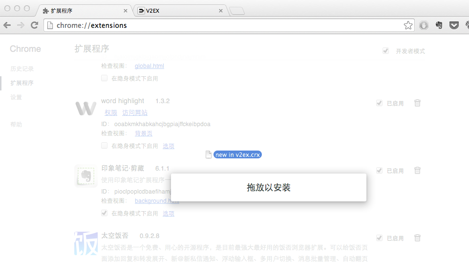
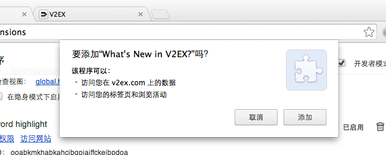

# What's New in V2EX?

## 介绍

其实就是在后台帮你扫一下 V2EX 有什么新帖，方便我这样的纠结症晚期患者。

## 安装

你有两个选择：直接 [安装](./new in v2ex.crx) 插件；或者自己用源码生成 package.

**注意** 如果你直接安装的话 Chrome 会提示你不给安装，请按照以下步骤：

1. 在 Chrome 中打开 [扩展程序](chrome://extensions/)
2. 把 `.crx` 拖进去
3. 点添加

如果你还不明白，请看图：

## todo

- 模板
- icon
- 出于避免「名人效应」的考虑，没有加入头像和发帖人，是否要加入？
- 为了避免上 V2EX 黑名单，目前必须 Chrome 在运行的时候才可以刷新新帖。这个应该怎么处理比较好？

## 联系我

如果你有什么意见建议，或者只是简单地吐槽一句「你这个东西太烂了！」，都欢迎 [发邮件](mailto:sethverlo5@gmail.com) 给我。

## 感谢

作为一个前端渣渣，期间麻烦了不少前端和全端巨巨…

- Front-End Developer: @Netputer
- Overflow-Stack Developer: @fanzeyi
- Front-End Developer/全世界最牛逼的吉他手: @ZerosXut
- Front-End Developer/会卖萌的老男人: @喵子
